# PORTFOLIO PROJECT - 2 JAVASCRIPT #

# Harry Potter Quiz
## Purpose
A Quiz is an intellectual game where the user's knowledge is tested in both a challenging and entertaining way, with feedback on each answer (correct or incorrect) and joining the leaderboard on completion.

* [Here is a link to the live site - Harry Potter Quiz](https://lynnemcgrail.github.io/Portfolio-Project-2-HarryPotter-Quiz/) 

## Final Design 
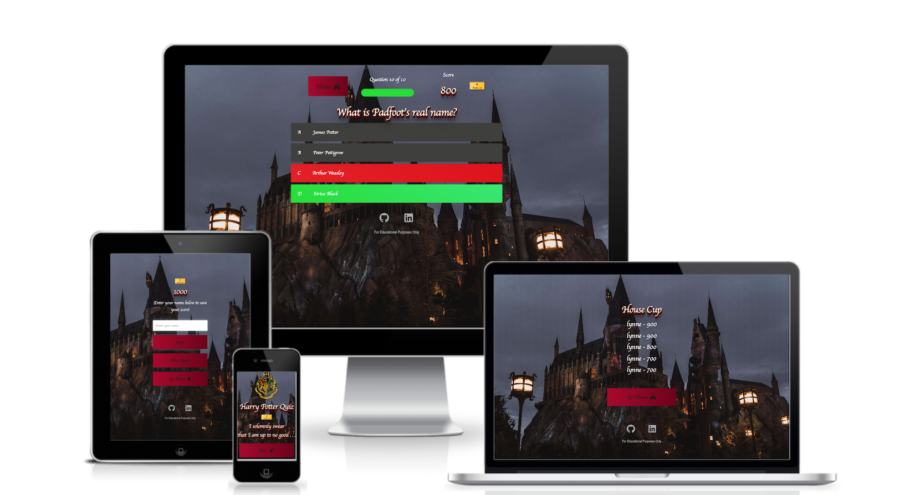

## Initial Idea Concept
My initial idea for this project was to create a quiz that is simple to use and has replay ability so that site users could play again with different questions and challenge themselves. This quiz is suitable for all ages and skill levels. I chose to reflect the Gryffindor colours so that it appealed to fans of the Harry Potter books and movies.
#### The features I wanted to include:
* Interactive quiz elements to enhance user experience.
* A progress bar so that the user can see how far through the quiz they are, and how many questions are left.
* A score keeper for amount of correct answers.
* Colour indicators that let the user know if the answer they selected is correct (green) or incorrect (red), the quiz will also highlight the correct answer in green, should the user guess the incorrect answer (highlighted in red) throughout the gameplay. 
* To use a colour scheme which signifies colours that users would associate with Harry Potter, I have used scarlett and gold throughout as they are the Gryffindor colours, and this is the house Harry is in.
* To create an easy to navigate quiz with buttons so that the user can navigate home, to play the game, save their score at the end and visit the highscores page. The user can also navigate back to the home page at any point during the quiz should they not wish to finish the game.
* For the quiz to look fun and interactive through colours, images and icons which are symbolic of The Wizarding World of Harry Potter. Note the broomstick and castle Font Awesome icons used within the quiz. The background audio is also the theme song for Harry Potter which aims to enhance the users experience and enjoyment.
* To include social network links in the footer to my professional portfolio, my Github and Linkedin accounts.
* To be fully responsive so that it works across all screen sizes and devices.

#
## Table of Contents
- [UX/UI](#uxui)
    * [SITE GOALS](#site-goals)
    * [USERSTORIES](#user-stories)
    * [REQUIREMENTS](#requirements)
    * [EXPECTATIONS](#expectations)
- [WIREFRAMES](#wireframes)
  * [FEATURES](#features)
  * [DESIGN](#design)
- [LANGUAGES USED](#languages-used)
  * [PROGRAMMES USED](#programmes-used)
- [TESTING](#testing)
  * [FUTURE FEATURES TO BE IMPLEMENTED](#future-features-to-be-implemented)
  * [DEVICES](#devices)
  * [VALIDATION AND ACCESSIBILITY](#validation-and-accessibility)
  * [LIGHTHOUSE](#lighthouse)
  * [ACCESSIBILITY](#accessibility)
  * [CSS](#css)
  * [HTML](#html)
  * [FUNCTIONALITY](#functionality)
- [BUGS AND ERRORS](#bugs-and-errors)
  * [SOLVED BUGS AND ERRORS](#solved-bugs-and-errors)
  * [UNSOLVED BUGS AND ERRORS](#unsolved-bugs-and-errors)
- [DEPLOYMENT](#deployment)
  * [REMOTE](#remote-deployment)
  * [HOW TO FORK A REPOSITORY](#how-to-fork-a-repository)
  * [HOW TO CLONE A REPOSITORY](#how-to-clone-a-repository)
  * [HOW TO MAKE A LOCAL CLONE](#how-to-make-a-local-clone)
- [CREDITS](#credits-and-references)
  * [IMAGES AND INFORMATION](#images-and-information-sources)
  * [CODE](#code-sources)
- [ACKNOWLEDGEMENTS](#acknowledgements)

# UX/UI
The quiz was created to show my programming knowledge of JAVASCRIPT, including HTML and CSS. 
## Site Goals
* To showcase my skills in JAVASCRIPT, HTML and CSS. 
* The provide an interactive experience that is easily accessible in terms of navigation and to manouver throughout the site.
* To personalise the quiz end score to each user.
* To easily be able to see thier progress and how many questions there are left.
* To display how many correct points the user has achieved throughout the quiz at all times.
* It needs to be instantly engaging to encourage the user to play the game.
* Questions to be randomised and drawn from a bank of available questions. This strengthens replay ability. 
* The user must be able to leave the quiz if they wish to, and return to the home page.

## First Time Visitor Goals
* I want it to be easy for the user to start game play.
* I want the user to be able to easily navigate throughout the site.
* I want the user to be able to visit the leaderboard and review their highscores.

## Returning & Frequent Visitor Goals
* I want to have different questions by randomising the question generator, in order to increase replayability and enhance user experience.
* To be able to review their top high scores to beat them by replaying the quiz and building on their Harry Potter knowledge. 

#
## User Stories  
The **user** is any person who has read the Harry Potter book series or seen the movies and would like to test their Wizarding World of Harry Potter knowledge.

| ID | ROLE | ACTION | GOAL |
|-----------------|:-------------|:---------------:|:---------------:|
| 1 | USER | As a user, I want to be able play the Harry Potter Quiz| So I can test my knowledge|
| 2 | USER | As a user, I want to be able to navigate around the interface easily | so it doesn't take me out of the experience|
| 3 | USER | As a user, I want to be able to play the quiz across all devices | So I can play the quiz while on the go or in different locations |
| 4 | USER | As a user, I want to be able to start the game when I am ready | So I can prepare myself |
| 5 | USER | As a user, I want to be able to track my score | So I can improve on it |
| 6 | USER | As a user, I want to see the correct answer highlighted if I answer incorrect | So I can see where I went wrong |
| 7 | USER | As a user, I want to be able to play a new game when the current one ends | So I can see if I can beat my score|
| 8 | USER | As a user, when I play the quiz I want the questions to be randomly ordered | So the game can be as challenging as possible |

#
## Requirements 
- Easy to navigate on various screen sizes and devices.
- Accessible and easy to understand how to play the quiz
- Keep the user engaged through user experience; progress bar, score keeper, ambient background music (optional), end score & the ability to join the highscores leaderboard.
- Networking links to the quiz creator's professional portfolio. 
- Visually inviting and readable, so user is not likely to leave the quiz page.

#
## Expectations 
- The user will be required to enter their username on finishing the game in order to join the highscores leaderboard
- All networking links will be functional and open in a separate tab
- I expect all page navigation links and buttons (e.g. audio toggle on/off) to work correctly and open in the same tab, but navigate to the option selected by the user. 
- I expect screen size not to affect the quality of the website.
- I expect each question to provide feedback to the user and let them know what the correct answer was, should they answer a question wrong.

## Design 
### Wireframes 
* I used [Balsamic](https://balsamiq.com/) to develop my wireframes for my website. I initially created the mobile version, and then scalled it up for tablet and desktop. Because one of my requirement is to give a seamless experience to the user to make them want when engaged with the quiz, there are navigation buttons throughout to enable this on all pages.
[The wireframes can be viewed here](assets/readme-docs/HP-wireframes.pdf)

## Site Structure
The Harry Potter quiz consists of multiple screens as the user interacts with and navigates through the quiz. The Home screen offers two navigation paths, one to enter the quiz, and another to see the highscores. Each screen has identifiable controls on them; the home page allows the user to initiate game play, also the sound icon enables the user to toggle the sound on or off. When the user progresses to play the quiz, they will find a home button to escape at any point, the progress bar will appear in gameplay to track questions answered out of total in quiz e.g. 1 of 10, and a score keeper which tallies the user's score as they progress through the quiz. Upon finishing the quiz the user is immediately taken to the results screen that gives the option to input their username and save their highscore, which will then show them the "House Cup" page. From the results screen they can also navigate back to the home page, or play the game again instantly.

## Design Choices
### Colour Scheme 
The final color scheme chosen was a rich dark red (scarlet) colour, and a gold colour. This colour scheme directly links back with the theme of the project: Harry Potter. These colours are often associated with Harry Potter, the main character, because of his association with the Gryffindor house, who's colours are red / scarlet and gold. The other colours used tie in with the theme of the project, which you can see the Hogwart's castle is captured at night, therefore the other colours used compliment the appearance and user experience. I used Coolors as my color palette generator to see them compliment each other side by side.
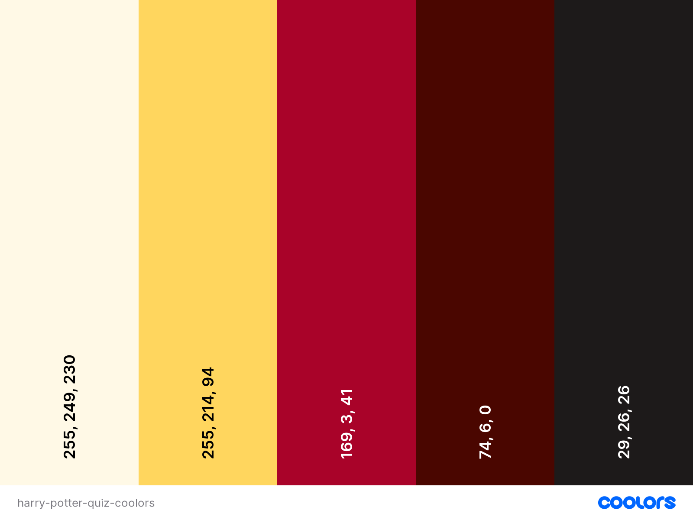

### Typography
The font chosen was Pathway Gothic and this is set to cursive for the main text, Sans-serif is the fallback font. I used Google Fonts to import into my css styling.

I chose this font as it ties nicely with the theme of the project. There is quite a historic, vintage feel to the font, and with the cursive styling I think it fits in with the Harry Potter theme and also works well alongside the Harry Potter logo in my project. 

# Features
This Harry Potter Quiz was created to produce an immersive experience for the user through the use of both design and site structure. It moves away from the typical website structure with the menubar and is structured and designed more like a game.

It is intuitively designed so the user can easily navigate it, along with visible and recognisable Home and Sound button icons, and visual ques reflecting the topic of the project.

#
## Features 
* The site consists of:
    * 5 main sections on one page, `HOME, ABOUT, UPCOMING EVENTS, GALLERY, CONTACT US`
    * The page contains a `HEADER (TITLE)`, `NAVBAR`, `MAIN CONTENT (TEXT AND IMAGES)` and `FOOTER (SOCIAL MEDIA ICONS/LINKS`
* Navigation bar:
    * The navigation bar is fully responsive to allow for various screen sizes. It includes links to maneuver through the site easily with each menu option navigating to it's particular section. 
     
    * On mobile and tablet screen sizes you can see the hamburger menu option appears, highlighting the responsiveness of the site across device sizes 
    * Hamburger navigation menu 
     
    
    

* Footer: 

## Navigation
* The site navigation is done through the clickable buttons which easily indicate how to navigate the game to the user. Throughout the site the user will find these buttons at hand to navigate away from their current stage at any point.
* The user can navigate to the home screen from wherever they are in the quiz through the home button. This has an icon of a castle, significant to the theme itself and easily recognised as a 'home' button feature. 
* The sound button is automatically muted on the website loading, but the sound can be activated or muted by the user, as they wish.
* Upon activation, the background music is the Harry Potter theme song, instantly recognised by Harry Potter fans and provides an immersive magical experience creating the atmosphere of the Harry Potter phenomenon.
* On the quiz starting the user will notice two informative icons are added to their gameplay experience: the game progress bar, and the user's score.
* On completion of the game the user will notice the ability to enter their username, save their score, visit the House Cup leaderboard, and be able to navigate to the home page or play the quiz again.

[insert images here of navigation]

## Home Page
* The Home Page is the screen that's visible first when the user enters the site. It is designed to be immediately recognisable to the user and easily allow the user to immediately start playing the quiz.
* In the middle of the screen, the user will see the quiz main content centered, a familiar quote from the books and movies "I solemnly swear that I am up to no good" and this is lay over a very recognisable Harry Potter themed background, the Hogwart's Castle.
* The title and logo sit on top of the quiz content, again giving the user information as to what topic the quiz is about.
* The user is presented with two buttons; a play button, and a Highscores button and from here the user has all that is required to play the quiz.

## HTML
**HTML Validator results:**
  All HTML was passed through the validator retreived from the source code within devtools on Chrome. 

  **Index.html:** 
  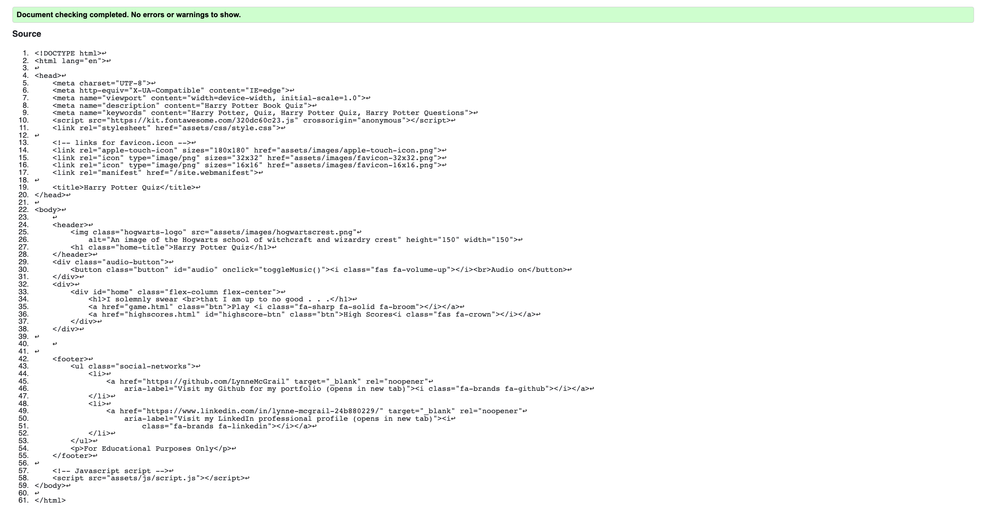

  **Game.html:** 
  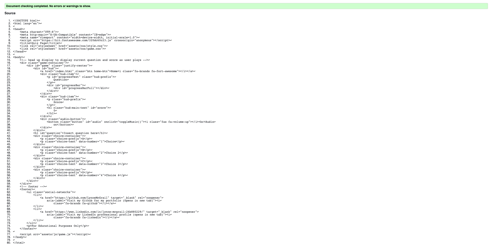

  **Highscores.html:** 
  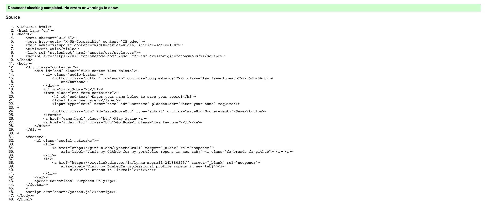

  **End.html:** 
  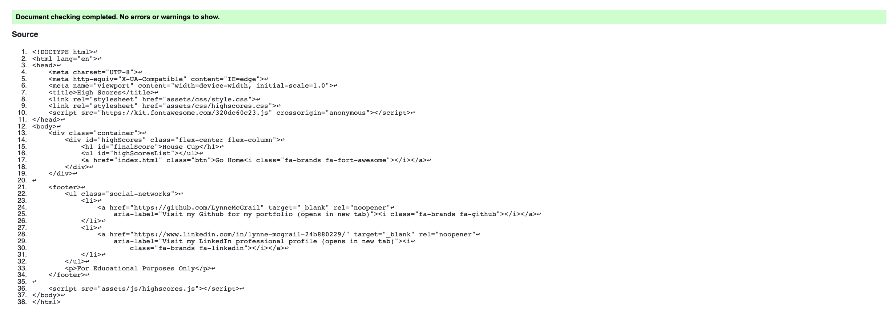

## Functionality
* All buttons and links have been hovered over and clicked on to ensure accessibility
* All networking links work correctly and open in a new tab
* All pages load correctly across all device screen sizes - see devices tested in testing section
* Functional buttons worked as intended on different device screen sizes
* All images and sound clips load on each page as intended

## Bugs and errors
### Solved bugs and errors

[insert here]
#
# Testing
## Code Validation and Accessibility
### JSHint 
The Javascript files were validated through JSHint. Due to there being multiple Javascript files, validating each page threw up multiple warnings, many of which were undefined varibles. This was due to the variables and functions being defined or called on other pages. The missing semicolon warnings do not affect functionality of the code.

JSHint came up with no errors and multiple warnings which are explained below in [Unresolved Bugs](<#unresolved-bugs>).

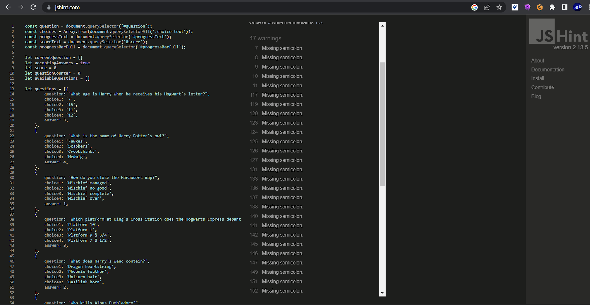
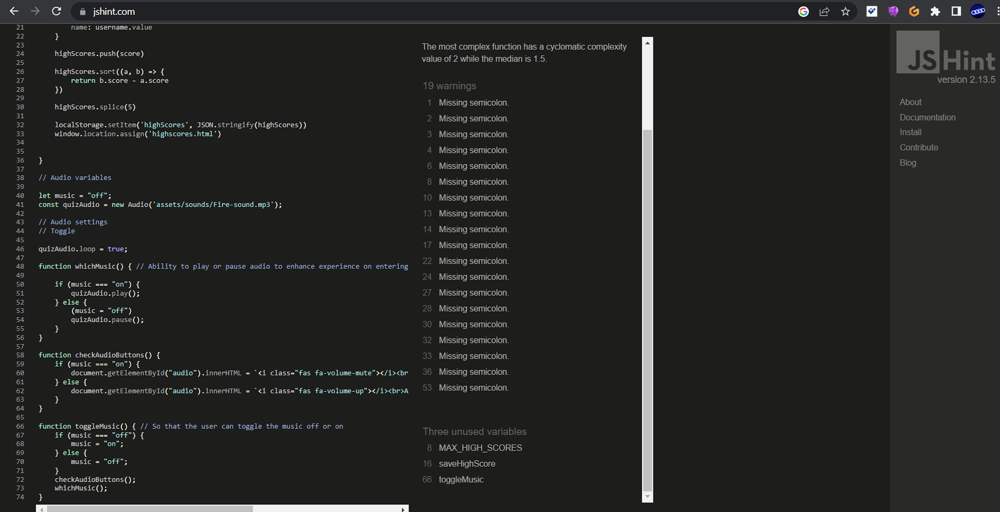
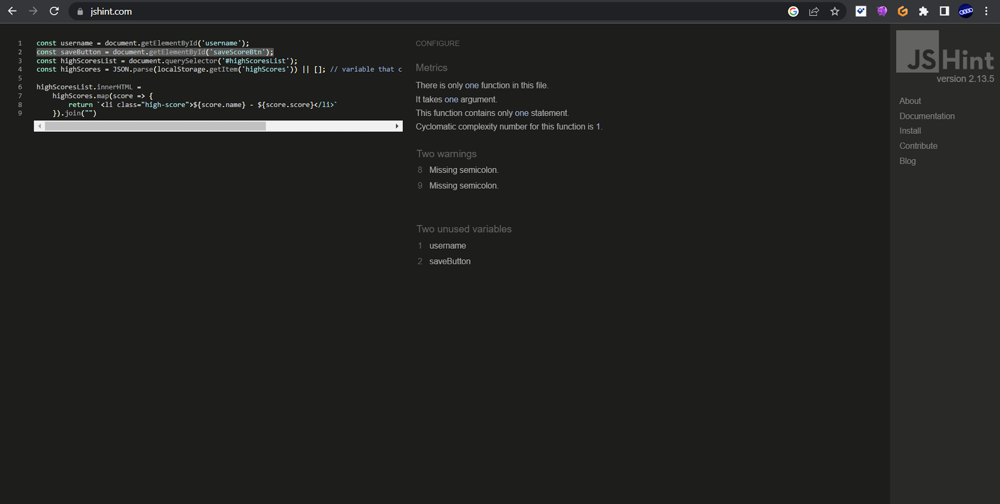

## **Lighthouse**
The quiz was also put through Lighthouse testing via Chrome DevTools which tests the site under 4 different headings; Performance, Accessibility, Best Practices and SEO and it tests it under mobile and desktop criteria.
 
### **Lighthouse Reports:**

#### index.html
  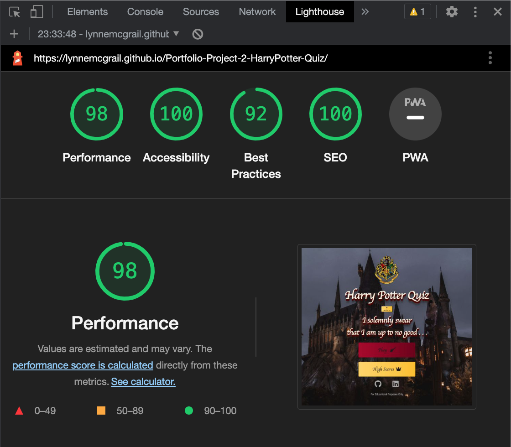
   

  #### game.html
  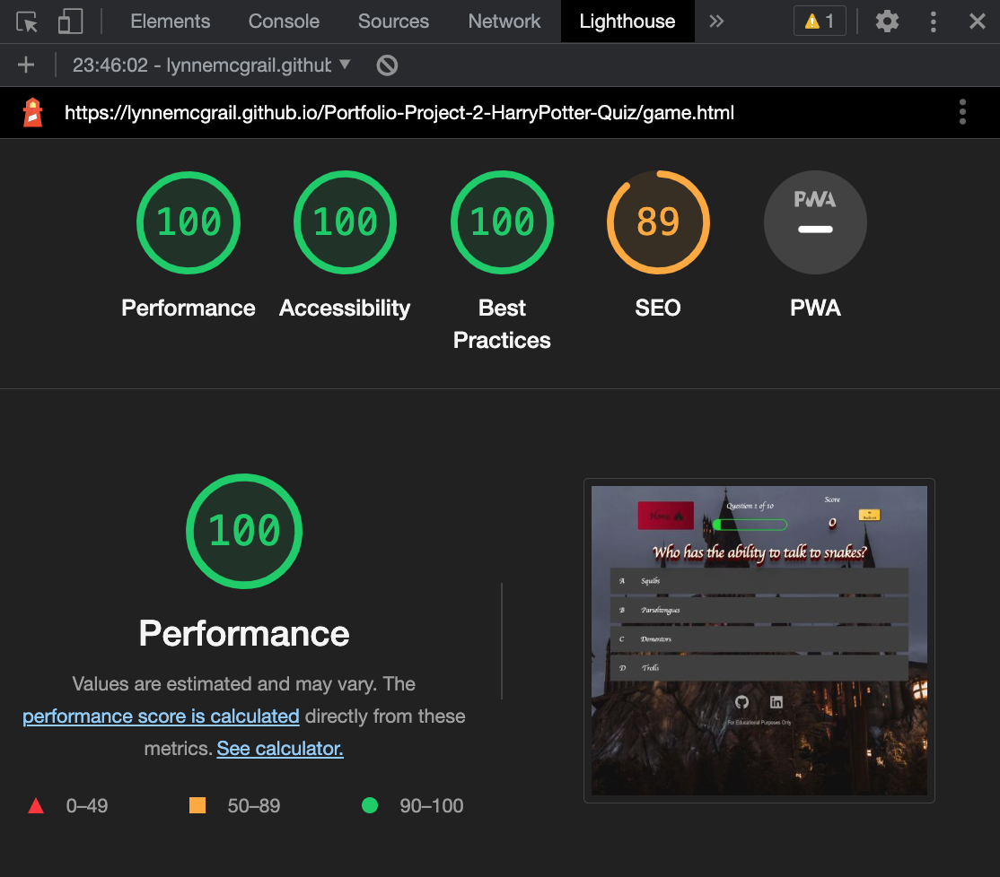
   

  #### end.html
  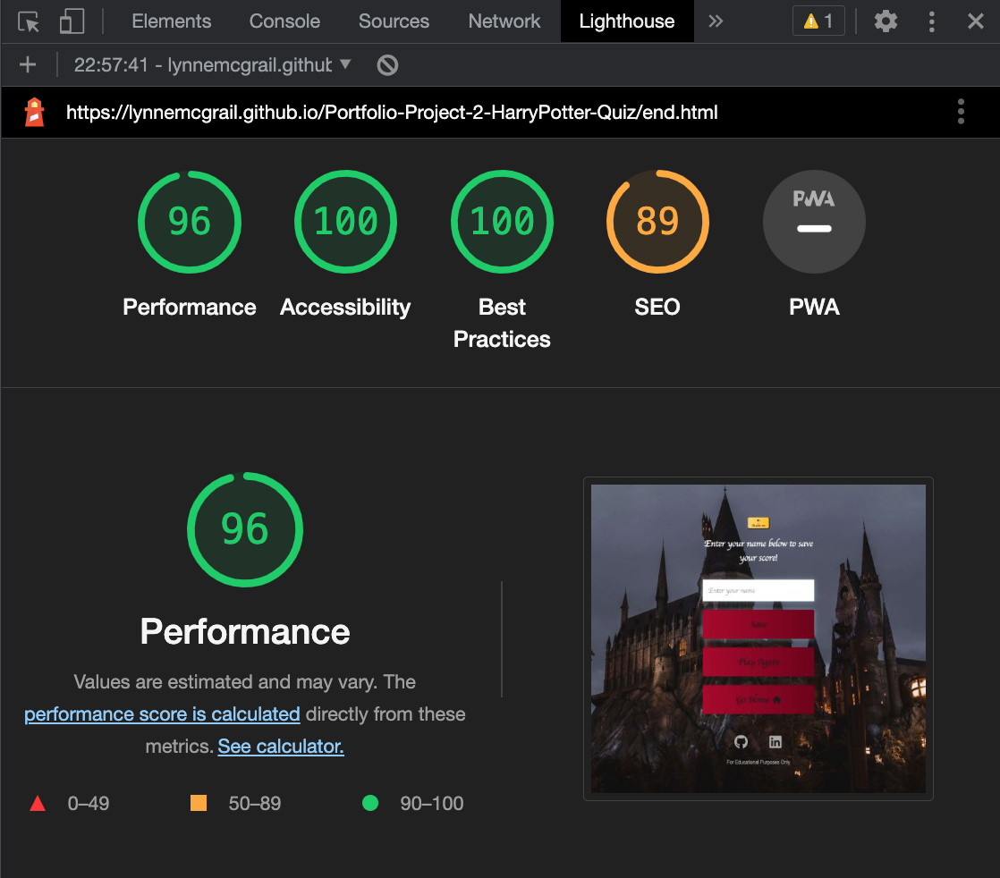
   

  #### highscores.html
  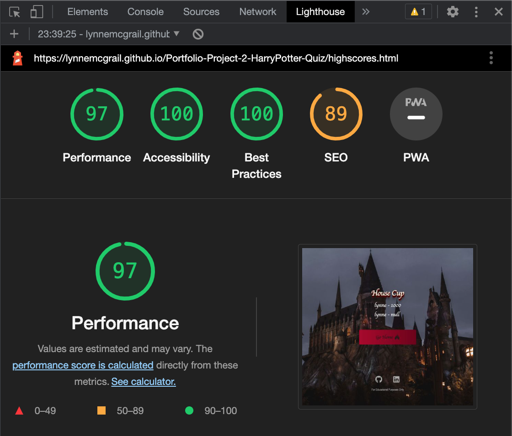
   

## Accessibility
### **WAVE Webaim Accessibility reports:**
* The WAVE tool was used to test all four pages on the site.
  See the summary of results below with links to the individual page results.  
    
  * [Link to Home Page (index.html) WAVE result](https://wave.webaim.org/report#/https://lynnemcgrail.github.io/Portfolio-Project-2-HarryPotter-Quiz/index.html)  
  * [Link to Quiz Game Page (game.html) WAVE result](https://wave.webaim.org/report#/https://lynnemcgrail.github.io/Portfolio-Project-2-HarryPotter-Quiz/game.html)  
  * [Link to End Game Page (end.html) WAVE result](https://wave.webaim.org/report#/https://lynnemcgrail.github.io/Portfolio-Project-2-HarryPotter-Quiz/end.html) 
  * [Link to Highscores Page (highscores.html) WAVE result](https://wave.webaim.org/report#/https://lynnemcgrail.github.io/Portfolio-Project-2-HarryPotter-Quiz/highscores.html)

## CSS
**CSS Validator results:**
  The style CSS file was tested 
  **style.css** 
  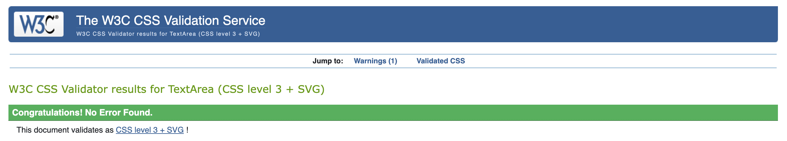
  * [Link to CSS highscores validator report](http://jigsaw.w3.org/css-validator/validator$link) 

  The game CSS file was tested 
  **game.css** 
  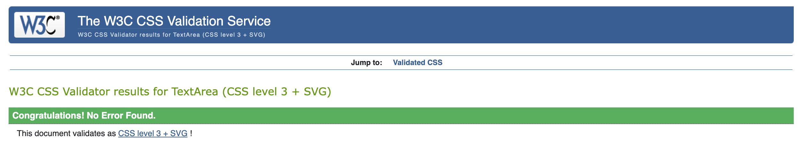
  * [Link to CSS highscores validator report](http://jigsaw.w3.org/css-validator/validator$link) 

The highscores CSS file was tested 
  **highscores.css** 
  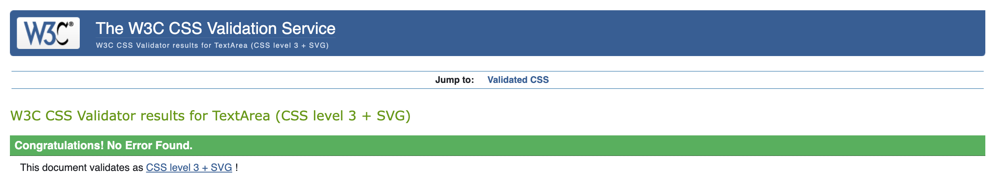
  * [Link to CSS highscores validator report](http://jigsaw.w3.org/css-validator/validator$link) 

#
## Credits and References
* [3D CSS effect in h1 CSS code](https://codepen.io/ryandsouza13/pen/yEBJQV). 
* [Hogwarts Crest image](https://commons.wikimedia.org/wiki/File:Hogwarts-Crest.png).
* Background image was from [Unsplash](https://unsplash.com/photos/5qUJfO4NU4o)
* Audio file for fire crackling sound was sourced from [Free Sounds Library](https://www.freesoundslibrary.com/fire-sound/)
* Audio file for Harry Potter Theme Song was sourced from [Youtube - link in video description](https://www.youtube.com/watch?v=eHn8eF0nwD0&ab_channel=KenezNonwar)
* [James Q Quick tutorial for building a quiz app](https://www.youtube.com/watch?v=u98ROZjBWy8&list=PLDlWc9AfQBfZIkdVaOQXi1tizJeNJipEx&ab_channel=JamesQQuick)
* [Javascript quiz tutorial source](https://www.sitepoint.com/simple-javascript-quiz/)
* [Code help for learning to loop audio](https://stackoverflow.com/questions/13610638/loop-audio-with-javascript)
* [Code for looping audio in Javascript](https://stackoverflow.com/questions/13610638/loop-audio-with-javascript)
* [Code help for learning to toggle play/pause function for audio in Javascript](https://siongui.github.io/2012/10/12/javascript-toggle-sound-onclick/)
* [Tutorial for using local storage for high scores](https://www.youtube.com/watch?v=jfOv18lCMmw&list=PLB6wlEeCDJ5Yyh6P2N6Q_9JijB6v4UejF&index=10&ab_channel=JamesQQuick)

### Code Sources

* Code for h1 3D CSS styling effect can be found here [Codepen](https://codepen.io/ryandsouza13/pen/yEBJQV)
* Responsive Design tutorials on [Youtube](https://www.youtube.com/) for responsive code in CSS - Kevin Powell, and Web Dev Simplified were particularly helpful to me. 
* Help creating responsive navigation with no JS was [Kevin Powell Youtube](https://www.youtube.com/watch?v=8QKOaTYvYUA&ab_channel=KevinPowell)
* The community on slack for feedback, and pointing me to [W3Schools](https://www.w3schools.com/) for more indepth guides to the uses of JAVASCRIPT, HTML and CSS. 
* Responsive media queries guidance was [W3Schools](https://www.w3schools.com/css/css_rwd_mediaqueries.asp)
* The guidance for the `hamburger menu` using CSS code was [unused-css.com](https://unused-css.com/blog/css-only-hamburger-menu/)
* To compress my audio file I found this website [Compress Audio Online](https://www.compresss.com/compress-audio.html)

#
## Acknowledgements:

- Code institute for the Mentors and Tutors on the course. Especially our Facilitator and Masterclass mentor [Simen Daehlin](https://github.com/Eventyret) and his patience helping us understand testing and bug solving.
- My Mentor [Jubril Akolade](https://www.linkedin.com/in/jubrillionaire/) for guiding me in the right direction and helping me establish good coding practice. Also for his guidance and advice on developing a more responsive website.
- My fellow classmates for their ideas and enthusiasm on our facilitator sessions and masterclasses, and also their support on Slack.
- Stack Overflow for troubleshooting and fixing errors
- The Slack community for tips, advice, quick fixes and kind words. Especially [Chris Williams](https://github.com/Chr15w1986) who gave me good advice and for better coding practice.
- My family for their support and patience.

#### RETURN TO THE [TOP](#harry-potter-quiz)